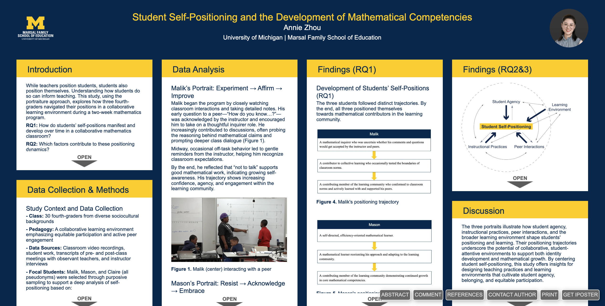

  

    <h1>Annie (Chenxi) Zhou</h1>

    
📧 Email: annie.zhou@wisc.edu

    
🔗 <a href="https://www.linkedin.com/in/annie-zhou-aabb09168/">LinkedIn</a>

    

      I am an incoming Ph.D. student in Curriculum and Instruction at the University of Wisconsin–Madison, advised by <a href="https://berland.org/">Prof. Matthew Berland</a>. As a learner, designer, and educator, I am committed to designing meaningful and engaging learning experiences that support diverse learners across contexts.
      You can find my CV here: <a href="Annie_Zhou_CV.pdf">CV</a>.
    

  

  

<h2>Research Interests</h2>

<ul>
  <li>Community-engaged learning</li>
  <li>Culturally responsive mathematics education</li>
  <li>Learning sciences and educational technology</li>
</ul>

<h2>Selected Publications</h2>

<ul>
  <li>
    <strong>Zhou, A.</strong>, Seefeldt, K., Hui, J., Bare, C., Sanifu, L., &amp; Dillahunt, T. R. (2026). A community-engaged curriculum design model for culturally responsive tech consulting. 
    <em>Proceedings of the 20th International Conference of the Learning Sciences (ICLS 2026). Irvine, USA: International Society of the Learning Sciences.</em>
  </li>

  <li>
    <strong>Zhou, A.</strong> (2026, April). 
    <em>Student Self-Positioning and the Development of Mathematical Competencies.</em> Roundtable session accepted for presentation at the Annual Meeting of the American Educational Research Association (AERA).
  </li>

  <li>
    Quintana, R. M., &amp; <strong>Zhou, A.</strong> (2026, April). 
    <em>Using affordance analysis to strategize the integration of AI-generated instructor avatars within MOOCs.</em> Poster session accepted for presentation at the Annual Meeting of the American Educational Research Association (AERA).
  </li>
</ul>

<h2>Selected Presentations</h2>

  
  

    

      <strong>Zhou, A.</strong> (2026, April). 
      <em>A community-engaged curriculum design model for culturally responsive tech consulting.</em>
      Short paper session accepted for presentation at the 20th International Conference of the Learning Sciences (ICLS 2026).
    

  

  
  

    

      <strong>Zhou, A.</strong> (2026, April). 
      <em>Student Self-Positioning and the Development of Mathematical Competencies.</em>
      Roundtable session accepted for presentation at the Annual Meeting of the American Educational Research Association (AERA).
    

  

  
  

    

      Quintana, R. M., &amp; <strong>Zhou, A.</strong> (2026, April). 
      <em>Using affordance analysis to strategize the integration of AI-generated instructor avatars within MOOCs.</em>
      Poster session accepted for presentation at the Annual Meeting of the American Educational Research Association (AERA).
    

  

