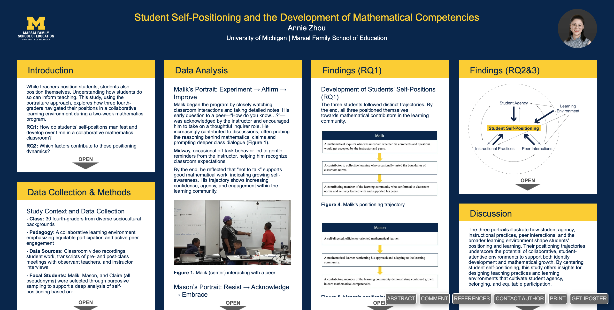

<button
  id="theme-toggle"
  class="theme-toggle"
  type="button"
  aria-label="Switch to dark mode"
  title="Switch theme"
>
  ☾
</button>

  

    <h1>Annie (Chenxi) Zhou</h1>

    
📧 Email: annie.zhou (at) wisc (dot) edu

    
🔗 <a href="https://www.linkedin.com/in/annie-zhou-aabb09168/">LinkedIn</a>

    

      I am a Ph.D. student in Curriculum and Instruction at the University of Wisconsin–Madison, advised by <a href="https://berland.org/">Prof. Matthew Berland</a>. As a learner, designer, and educator, I am committed to designing meaningful and engaging learning experiences that support diverse learners across contexts.
    

    
    
📄 You can find my curriculum vitae here: <a href="Annie_Zhou_CV.pdf">CV</a>.

  

  

<h2>Research Interests</h2>

<ul>
  <li>Community-engaged learning</li>
  <li>Culturally responsive mathematics education</li>
  <li>Learning sciences</li>
  <li>Educational technology</li>
</ul>

<h2>Selected Publications</h2>

<ul>
  <li>
    <strong>Zhou, A.</strong>, Seefeldt, K., Hui, J., Bare, C., Sanifu, L., &amp; Dillahunt, T. R. (2026). <a href="https://2026.isls.org/docs/ICLS%20Volume%202026.pdf" target="_blank" rel="noopener noreferrer"> A community-engaged curriculum design model for culturally-responsive tech consulting </a>. In B. K. Litts, D. DeLiema, C. Lee, S. Krist, A. Mawasi, L. Martin, &amp; K. Kumpulainen (Eds.), <em>Proceedings of the 20th International Conference of the Learning Sciences: ICLS 2026</em> (pp. 1797&ndash;1801). International Society of the Learning Sciences.
  </li>

  <li>
    Quintana, R., Tan, Y., Quintana, C., <strong>Zhou, A.</strong>, & Wu, J. (2026). Mapping practitioner openness and hesitation toward GenAI integration in learning design. In Advances in quantitative ethnography: 8th International Conference on Quantitative Ethnography, ICQE 2026, Hiroshima, Japan, November 9–13, 2026, proceedings. Springer.
  </li>
  
  <li>
    <strong>Zhou, A.</strong> (2026, April). 
    <em>Student Self-Positioning and the Development of Mathematical Competencies.</em> Roundtable session accepted for presentation at the Annual Meeting of the American Educational Research Association (AERA).
  </li>

  <li>
    Quintana, R. M., &amp; <strong>Zhou, A.</strong> (2026, April). 
    <em>Using affordance analysis to strategize the integration of AI-generated instructor avatars within MOOCs.</em> Poster session accepted for presentation at the Annual Meeting of the American Educational Research Association (AERA).
  </li>
</ul>

<h2>Selected Presentations</h2>

 <a href="CTC.pdf" style="flex-shrink: 0;"> 
  
 </a> 
 
 <strong>Zhou, A.</strong> (2026, June). <em>A community-engaged curriculum design model for culturally responsive tech consulting.</em> Short paper session accepted for presentation at the 20th International Conference of the Learning Sciences (ICLS 2026). 
 
 

  <a href="https://aera26.ipostersessions.com/Default.aspx?s=E2-A5-29-9B-90-FF-4C-D6-31-83-98-21-81-B9-16-EA" style="flex-shrink: 0;">
    

      
    

  </a>

  

    

      <strong>Zhou, A.</strong> (2026, April). 
      <em>Student Self-Positioning and the Development of Mathematical Competencies.</em>
      Roundtable session accepted for presentation at the Annual Meeting of the American Educational Research Association (AERA).
    

  

 <a href="https://aera26.ipostersessions.com/Default.aspx?s=78-3D-39-8D-93-35-24-3B-DB-F4-94-2B-D2-03-E2-FC" style="flex-shrink: 0;"> 
  
 </a> 
 
 Quintana, R. M., &amp; <strong>Zhou, A.</strong> (2026, April). <em>Using affordance analysis to strategize the integration of AI-generated instructor avatars within MOOCs.</em> Poster session accepted for presentation at the Annual Meeting of the American Educational Research Association (AERA). 
 
 

<h2>Public Scholarship</h2>
<ul>
  <li>
   <strong>Zhou, A.</strong> (2025, June). <a href="https://blogs.lib.umich.edu/student-stories/good-teaching-historical-perspective-culturally-responsive-teaching">Good teaching from a historical perspective: Culturally responsive teaching</a>. <em>University of Michigan Library Student Stories Blog</em>.
  </li>
  <li>
    <strong>Zhou, A.</strong> (2025, February). <a href="https://sites.lsa.umich.edu/equitable-teaching/stories-of-culturally-responsive-teaching-from-frontline-instructors/">Stories of culturally responsive teaching from frontline instructors</a>. <em>Equitable Teaching Project, University of Michigan</em>.
  </li>
 </ul>

